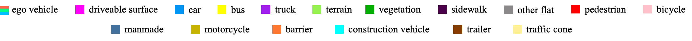

# TPVFormer: An academic alternative to Tesla's Occupancy Network
### [Paper](https://arxiv.org/pdf/2302.07817) | [Project Page](https://wzzheng.net/TPVFormer/) | [Leaderboard](https://www.nuscenes.org/lidar-segmentation?externalData=all&mapData=all&modalities=Camera)

> Tri-Perspective View for Vision-Based 3D Semantic Occupancy Prediction, CVPR 2023

> [Yuanhui Huang](https://scholar.google.com/citations?hl=zh-CN&user=LKVgsk4AAAAJ)*, [Wenzhao Zheng](https://wzzheng.net/)\* $\dagger$, [Yunpeng Zhang](https://scholar.google.com/citations?user=UgadGL8AAAAJ&hl=zh-CN&oi=ao), [Jie Zhou](https://scholar.google.com/citations?user=6a79aPwAAAAJ&hl=en&authuser=1), [Jiwen Lu](http://ivg.au.tsinghua.edu.cn/Jiwen_Lu/)$\ddagger$

\* Equal contribution $\dagger$ Project leader $\ddagger$ Corresponding author

## News

- **[2023/11/28]** We have released a 3D occupancy world model [OccWorld](https://github.com/wzzheng/OccWorld)! 
- **[2023/11/23]** Check out our recent [SelfOcc](https://github.com/huang-yh/SelfOcc) for **self-supervised** 3D occupancy prediction! 
- **[2023/6/14]** Code for Semantic Scene Completion on SemanticKITTI has been released.
- **[2023/4/12]** Check out [OccFormer](https://github.com/zhangyp15/OccFormer) for a high-performing head for occupancy prediction!
- **[2023/3/3]** We have reorganized the code to improve readability.  
- **[2023/2/28]** TPVFormer is accepted to CVPR 2023!
- **[2023/2/26]** See [SurroundOcc](https://github.com/weiyithu/SurroundOcc) for a more dense 3D occupancy prediction!
- **[2023/2/23]** Visualization code has been released.
- **[2023/2/16]** Paper released on [arXiv](https://arxiv.org/abs/2302.07817).
- **[2023/2/12]** Initial code release.
- **[2022/11/20]** Demo release.

## Demo




### A full demo video can be downloaded [here](https://cloud.tsinghua.edu.cn/f/594cadf14ae949228df1/).

## Introduction
Modern methods for vision-centric autonomous driving perception widely adopt the bird's-eye-view (BEV) representation to describe a 3D scene. Despite its better efficiency than voxel representation, it has difficulty describing the fine-grained 3D structure of a scene with a single plane. To address this, we propose a tri-perspective view (TPV) representation which accompanies BEV with two additional perpendicular planes. We model each point in the 3D space by summing its projected features on the three planes. To lift image features to the 3D TPV space, we further propose a transformer-based TPV encoder (TPVFormer) to obtain the TPV features effectively. We employ the attention mechanism to aggregate the image features corresponding to each query in each TPV plane. Experiments show that our model trained with sparse supervision effectively predicts the semantic occupancy for all voxels. We demonstrate for the first time that using only camera inputs can achieve comparable performance with LiDAR-based methods on the LiDAR segmentation task on nuScenes.

## Installation

1. Create conda environment with python version 3.8

2. Install pytorch and torchvision with versions specified in requirements.txt

3. Follow instructions in https://mmdetection3d.readthedocs.io/en/latest/getting_started.html#installation to install mmcv-full, mmdet, and mmsegmentation with versions specified in requirements.txt

4. Install timm, numba and pyyaml with versions specified in requirements.txt

## Preparing
1. Download pretrain weights from https://github.com/zhiqi-li/storage/releases/download/v1.0/r101_dcn_fcos3d_pretrain.pth and put it in ckpts/

2. Create soft link from data/nuscenes to your_nuscenes_path
   
3. Download our generated train/val pickle files and put them in data/
    nuscenes_infos_train.pkl
    https://cloud.tsinghua.edu.cn/f/ede3023e01874b26bead/?dl=1
    nuscenes_infos_val.pkl
    https://cloud.tsinghua.edu.cn/f/61d839064a334630ac55/?dl=1

  

  The dataset should be organized as follows:

```
TPVFormer/data
    nuscenes                 -    downloaded from www.nuscenes.org
        lidarseg
        maps
        samples
        sweeps
        v1.0-trainval
    nuscenes_infos_train.pkl
    nuscenes_infos_val.pkl
```

## Getting Started
### Training

1. Train TPVFormer for lidar segmentation task on A100 with 40G GPU memory.
```
bash launcher.sh config/tpv_lidarseg.py out/tpv_lidarseg 
```

2. Train TPVFormer for lidar segmentation task on 3090 with 24G GPU memory.
```
bash launcher.sh config/tpv_lidarseg_dim64.py out/tpv_lidarseg_dim64
```

3. Train TPVFormer for 3D semantic occupancy prediction task on 3090 with 24G GPU memory. 
```
bash launcher.sh config/tpv04_occupancy.py out/tpv_occupancy
```

### Evaluation for LiDAR Segmentation Metric

1. We release the weights for 3D semantic occupancy prediction at https://cloud.tsinghua.edu.cn/f/3fbd12101ead4397a0f7/?dl=1, and the weights for LiDAR segmentation at https://cloud.tsinghua.edu.cn/f/f686e97feb18406592d9/?dl=1.

2. Run eval.py to calculate mIoU for lidarseg.

```
python eval.py --py-config xxxx --ckpt-path xxxx
```

### Visualizations

Read visualization/readme.md for detailed instructions.

## Semantic Scene Completion on SemanticKITTI
Please refer to [kitti_ssc](https://github.com/wzzheng/TPVFormer/tree/3734fe1e9af71fd93755996d2c74c3ab10d9d064/kitti_ssc) for more details.

## Comparisons with Tesla's Occupancy Network

|                          | **Tesla's Occupancy Network**        | **Our TPVFormer**                |
| ------------------------ | ------------------------------------ | -------------------------------- |
| **Volumetric Occupancy** | Yes                                  | Yes                              |
| **Occupancy Semantics**  | Yes                                  | Yes                              |
| **#Semantics**           | >= 5                                 | **16**                           |
| **Input**                | 8 camera images                      | 6 camera images                  |
| **Training Supervision** | Dense 3D reconstruction              | **Sparse LiDAR semantic labels** |
| **Training Data**        | ~1,440,000,000 frames                | **28,130 frames**                |
| **Arbitrary Resolution** | Yes                                  | Yes                              |
| **Video Context**        | **Yes**                              | Not yet                          |
| **Training Time**        | ~100,000 gpu hours                   | **~300 gpu hours**               |
| **Inference Time**       | **~10 ms on the Tesla FSD computer** | ~290 ms on a single A100         |

## Related Projects
Our code is based on [BEVFormer](https://github.com/fundamentalvision/BEVFormer) and [Cylinder3D](https://github.com/xinge008/Cylinder3D). Many thanks to them!

Welcome to see  [SurroundOcc](https://github.com/weiyithu/SurroundOcc) for a more dense 3D occupancy prediction. You can also use [SurroundOcc](https://github.com/weiyithu/SurroundOcc)'s generated dense occupancy ground truths for training instead of sparse lidar supervision.

Also, remember to check out [OccFormer](https://github.com/zhangyp15/OccFormer) for an effective and efficient transformer encoder-decoder specially designed for occupancy prediction.

## Citation

If you find this project helpful, please consider citing the following paper:
```
@article{huang2023tri,
    title={Tri-Perspective View for Vision-Based 3D Semantic Occupancy Prediction},
    author={Huang, Yuanhui and Zheng, Wenzhao and Zhang, Yunpeng and Zhou, Jie and Lu, Jiwen },
    journal={arXiv preprint arXiv:2302.07817},
    year={2023}
}
```

