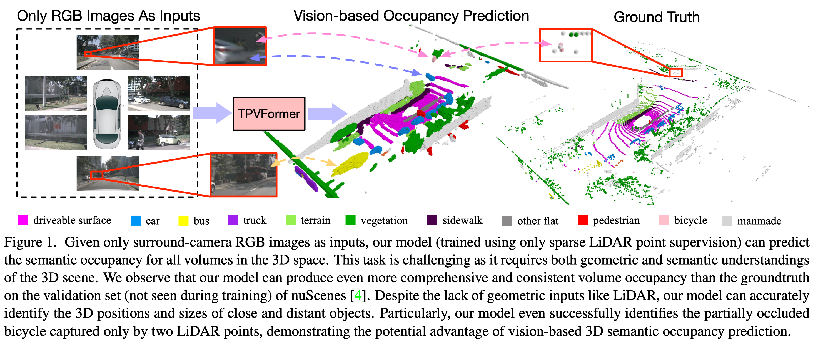
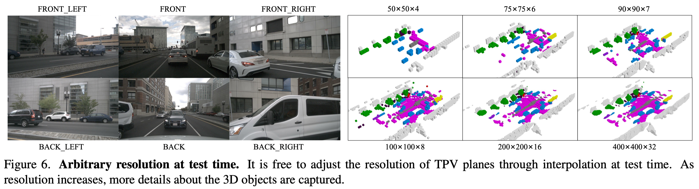
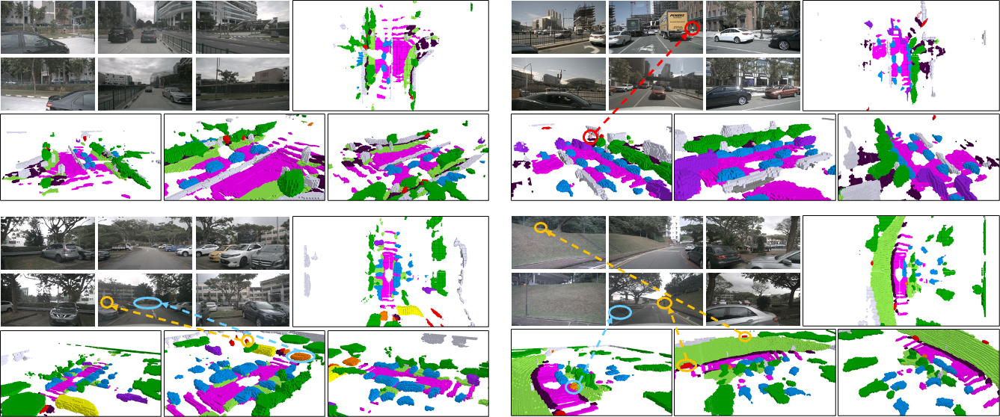
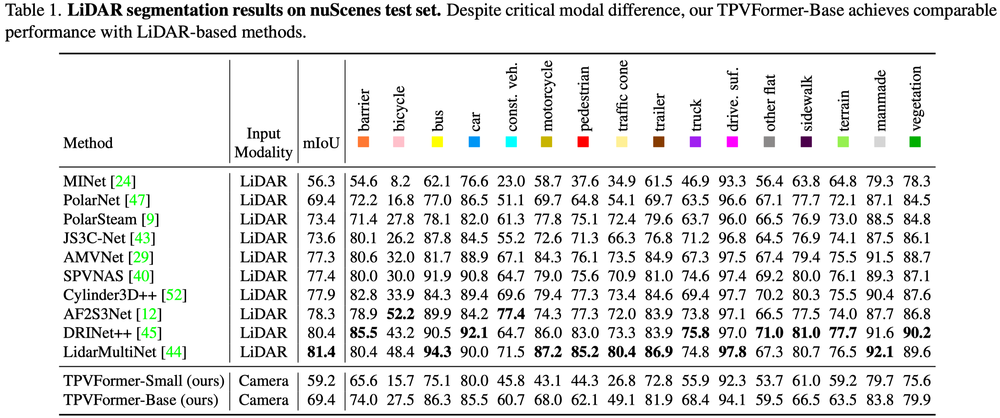

# TPVFormer: An academic alternative to Tesla's Occupancy Network
Under construction. 

## News

2023/2/12 Initial code release.

## Demo


### A full demo video can be downloaded [here](https://cloud.tsinghua.edu.cn/f/594cadf14ae949228df1/).

## Installation
1. Create conda environment with python version 3.8

2. Install pytorch and torchvision with versions specified in requirements.txt

3. Follow instructions in https://mmdetection3d.readthedocs.io/en/latest/getting_started.html#installation to install mmcv-full, mmdet, mmsegmentation and mmdet3d with versions specified in requirements.txt

4. Install timm, numba and pyyaml with versions specified in requirements.txt

## Preparing
1. Download pretrain weights from https://github.com/zhiqi-li/storage/releases/download/v1.0/r101_dcn_fcos3d_pretrain.pth and put it in ckpts/

2. Create soft link from data/nuscenes to your_nuscenes_path

3. Download train/val pickle files and put them in data/
nuscenes_infos_train.pkl
https://cloud.tsinghua.edu.cn/f/ede3023e01874b26bead/?dl=1
nuscenes_infos_val.pkl
https://cloud.tsinghua.edu.cn/f/61d839064a334630ac55/?dl=1

## Getting Started
1. Train TPVFormer for lidar segmentation task on A100 with 40G GPU memory.
```
bash launcher.sh config/tpv_lidarseg.py out/tpv_lidarseg 
```

2. Train TPVFormer for lidar segmentation task on 3090 with 24G GPU memory.
```
bash launcher.sh config/tpv_lidarseg_dim96.py out/tpv_lidarseg_dim96
```

3. Train TPVFormer for 3D semantic occupancy prediction task on 3090 with 24G GPU memory. 
```
bash launcher.sh config/tpv04_occupancy.py out/tpv_occupancy --lovasz-input voxel
```

## Comparisons with Tesla's Occupancy Network

|                          | **Tesla's Occupancy Network**        | **Our TPVFormer**                |
| ------------------------ | ------------------------------------ | -------------------------------- |
| **Volumetric Occupancy** | Yes                                  | Yes                              |
| **Occupancy Semantics**  | Yes                                  | Yes                              |
| **#Semantics**           | >= 5                                 | **16**                           |
| **Input**                | 8 camera images                      | 6 camera images                  |
| **Training Supervision** | Dense 3D reconstruction              | **Sparse LiDAR semantic labels** |
| **Training Data**        | ~1,440,000,000 frames                | **28,130 frames**                |
| **Arbitrary Resolution** | Yes                                  | Yes                              |
| **Video Context**        | **Yes**                              | Not yet                          |
| **Training Time**        | ~100,000 gpu hours                   | **~300 gpu hours**               |
| **Inference Time**       | **~10 ms on the Tesla FSD computer** | ~290 ms on a single A100         |

## Visualizations








## Lidar Segmentation Results


