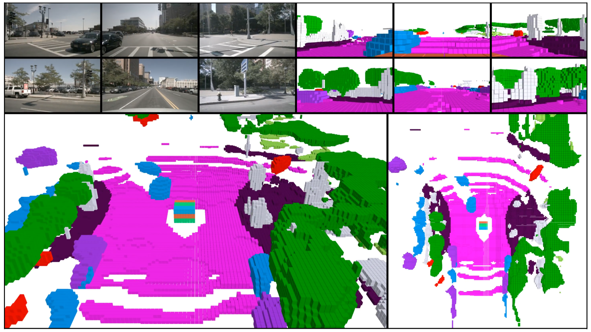

## Installation
Install the following packages.
```
pyvirtualdisplay==3.0
mayavi==4.8.1
PyQt5==5.15.7
```

## How to visualize a keyframe in nuScenes dataset?

For better visual effect, we highly recommend setting the scale_{h, w, z} params in the config file to a larger value to enable test-time upsampling.

We use the command line argument "--mode" to determine what to visualize: 0 for occupancy prediction, 1 for lidar segmentation prediction, 2 for lidar segmentation ground truth.


```
python visualization/vis_frame.py --py-config config/tpv04_occupancy.py --work-dir out/tpv_occupancy --ckpt-path out/tpv_occupancy/latest.pth --save-path out/tpv_occupancy/frames --frame-idx 4509 --mode 0
```

The color bar can be found in assets/legend.png.

## How to generate the video demo?



(A sampled frame from the video demo)

Note that we also use the camera sweep data without annotation from nuScenes dataset in order to produce videos with higher fps.

### 1. prepare scene-level pkl files

Since every video clip corresponds to a scene in nuScenes dataset, we rearrange the pkl files according to the scene information.

```
python visualization/dump_pkl.py --src-path data/nuscenes_infos_val.pkl --dst-path data/nuscenes_infos_val_scene.pkl --data-path data/nuscenes
```

### 2. generate individual video frames

For better visual effect, we recommend setting the scale_{h, w, z} params in the config file to a larger value to enable test-time upsampling.

Note that this step sometimes gets killed after a while for some unknown reason, so we recommend run the script for a single scene each time.

```
python visualization/vis_scene.py --py-config config/tpv04_occupancy.py --work-dir out/tpv_occupancy --ckpt-path out/tpv_occupancy/latest.pth --save-path out/tpv_occupancy/videos --scene-name scene-0916 scene-0015
```

### 3. generate video flow from frames

```
python visualization/generate_videos.py --scene-dir out/tpv_occupancy/videos --scene-name scene-0916 scene-0015
```

The color bar can be found in assets/legend.png.